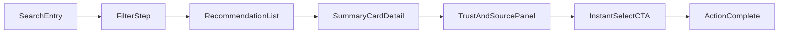

# 핵심 플로우 와이어프레임

## 범위
- 검색 → 추천 리스트 → 요약 카드 → 신뢰/출처 → 즉시 선택 CTA
- 1차 타겟(시간 압박형 워킹맘) 기준으로 기본 경로를 최적화

## IA 구조
- `검색`
- `추천`
- `저장`
- `마이페이지`

## End-to-End 플로우

## 화면별 와이어프레임 명세

### 1. 검색 시작 화면 (`SearchEntry`)
필수 영역:
- 상단 검색바: 자유 검색(예: 아기 보습크림)
- 빠른 선택칩: 아이 나이 / 사용 목적 / 예산
- 최근 검색어: 3개 노출

핵심 인터랙션:
- 키워드 입력 3초 이내 추천 결과 진입
- 입력이 어려운 사용자를 위해 "질문으로 찾기" 버튼 제공

### 2. 조건 선택 화면 (`FilterStep`)
필수 영역:
- 질문 1: 아이 나이(0-12m, 1-3y, 4-6y)
- 질문 2: 사용 목적(보습, 진정, 야외활동 등)
- 질문 3: 예산대(저가/중가/고가)

핵심 인터랙션:
- 단계당 1탭 선택 방식
- 하단 고정 CTA: `추천 보기`

### 3. 추천 리스트 화면 (`RecommendationList`)
필수 영역:
- 상단 요약: "워킹맘 조건에 맞는 추천 3개"
- 카드 리스트: 랭크, 제품명, 한 줄 결론, 신뢰 점수
- 비교 토글: 기본 OFF (필요 시 ON)

핵심 인터랙션:
- 기본은 Top 1 강조 + Top 3 보조 노출
- 리스트 진입 시 상단 카드 자동 포커스

### 4. 요약 카드 상세 (`SummaryCardDetail`)
고정 템플릿:
- 장점 3가지
- 단점 2가지
- 추천 대상 1줄
- 비추천 상황 1줄

핵심 인터랙션:
- 긴 텍스트는 접힘/펼침
- 요약 블록은 첫 화면에서 완전 노출

### 5. 신뢰/출처 패널 (`TrustAndSourcePanel`)
필수 영역:
- 신뢰 점수(예: 92, 매우 신뢰)
- 점수 근거 한 줄
- 출처 목록(맘카페/전문가/쇼핑리뷰 비율)
- 검증 배지(실구매 인증, 최근성 충족)

핵심 인터랙션:
- "왜 이 점수인가요?" 클릭 시 근거 모달 오픈
- 원문 보기 링크는 새 창 이동(앱 내 이탈 경고 포함)

### 6. 즉시 선택 CTA (`InstantSelectCTA`)
필수 영역:
- 확신형 카피: `이 제품이면 충분합니다`
- 보조 근거: `유사 프로필 80%가 선택`
- 행동 버튼: `바로 선택하기`, `저장 후 보기`

핵심 인터랙션:
- 기본 강조 버튼은 `바로 선택하기`
- 고민 사용자용 보조 액션(저장) 제공

## 상태/예외 플로우
- 결과 부족: "조건을 완화하면 더 많은 추천을 볼 수 있어요"
- 신뢰 점수 낮음: "주의 필요" 배지 + 대체 추천 제시
- 네트워크 지연: 스켈레톤 + 3초 초과 시 진행 상태 메시지

## 접근성/사용성 기준
- 본문 최소 16px, CTA 18px
- 탭 타깃 최소 44px
- 신뢰 점수는 숫자 + 텍스트 라벨 병행(색 의존 금지)
